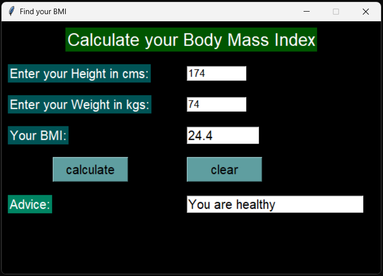

# ⚖️ Python Tkinter BMI Calculator

A simple, user-friendly desktop GUI application built with Python and Tkinter that calculates Body Mass Index (BMI) and provides instant health feedback.

### 📸 Application Interface


### ✨ Features
* **Accurate Calculation:** Converts height (cm) and weight (kg) to calculate the user's BMI.
* **Smart Feedback:** Automatically categorizes the result and provides basic health advice:
  * BMI < 17: "Get foods"
  * BMI > 25: "No more foods"
  * Normal range: "You are healthy"
* **Error Handling:** Includes a warning message box if the user leaves fields blank or enters invalid text instead of numbers.
* **Custom Styling:** Features a dark-themed UI with specific color branding (`cadet blue`, `#005456`) and customized fonts.
* **Reset Functionality:** A dedicated "Clear" button to instantly reset the form for a new calculation.

### 🛠️ Built With
* **Python 3**
* **Tkinter** (Standard GUI library for Python)

### 🚀 How to Run
Since this uses Python's built-in `tkinter` library, there are no external dependencies to install.

1. Clone or download this repository.
2. Open your terminal or command prompt.
3. Run the script:
   ```bash
   python BMI3conditionmassegebox.py


   ---

